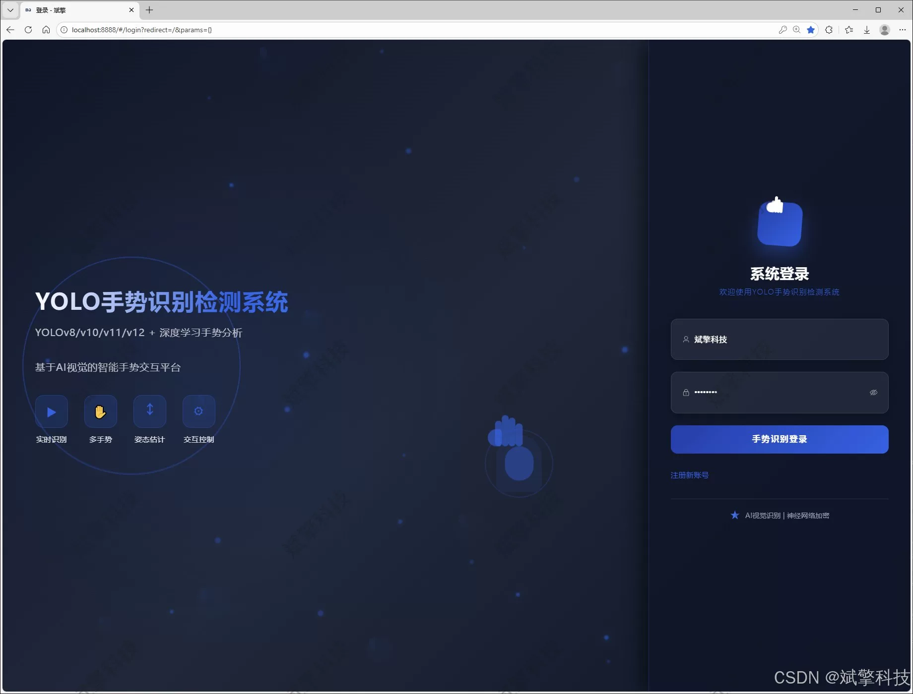
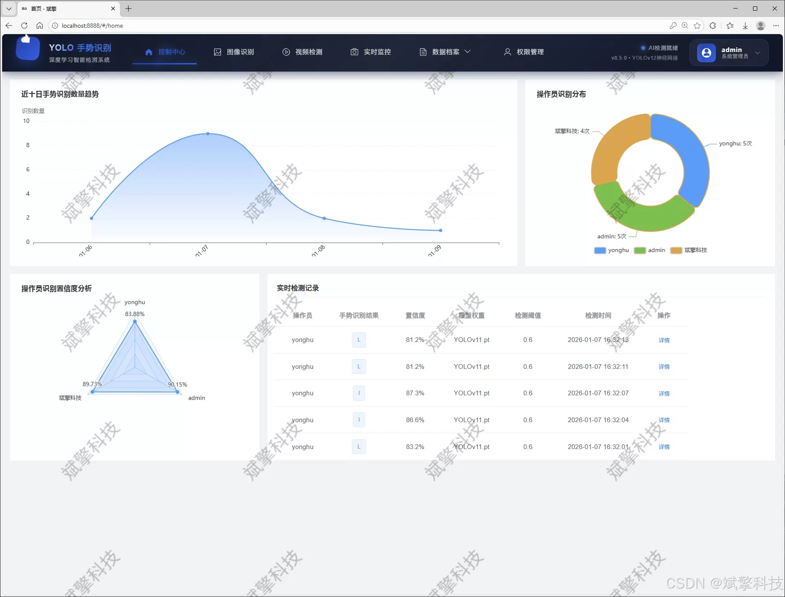
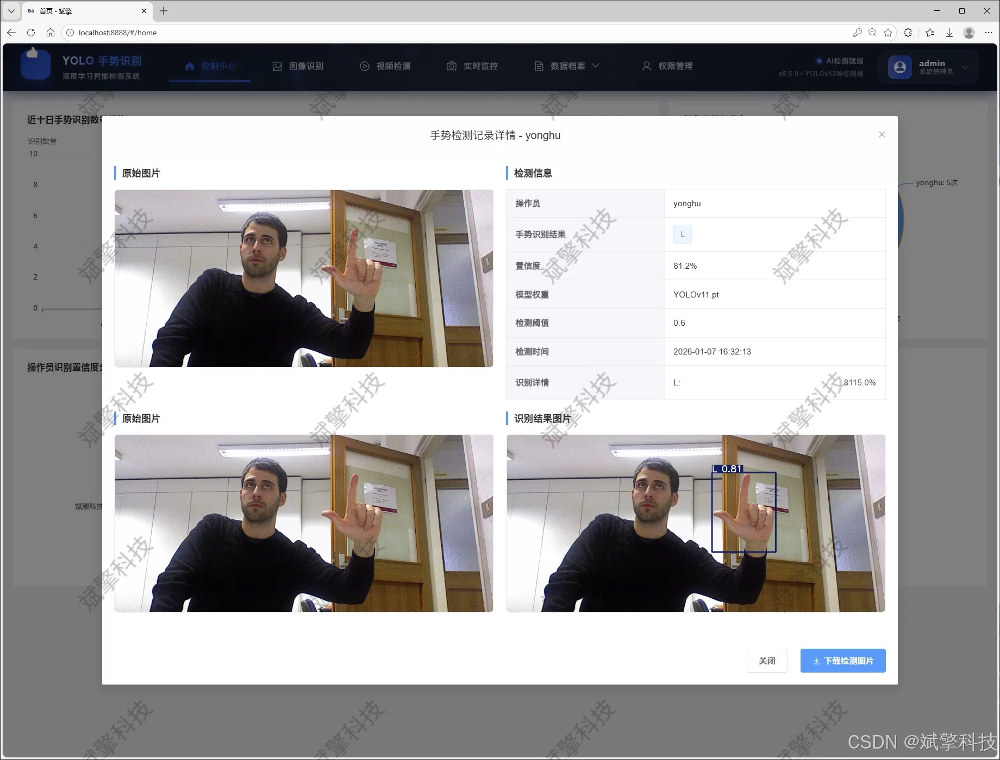
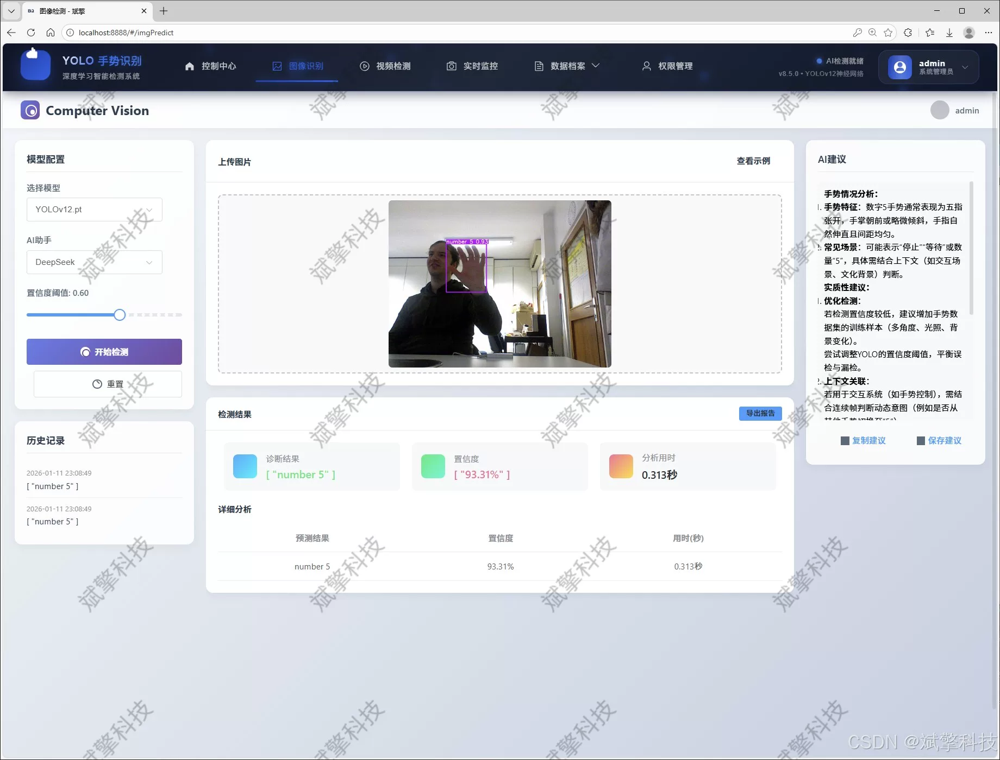
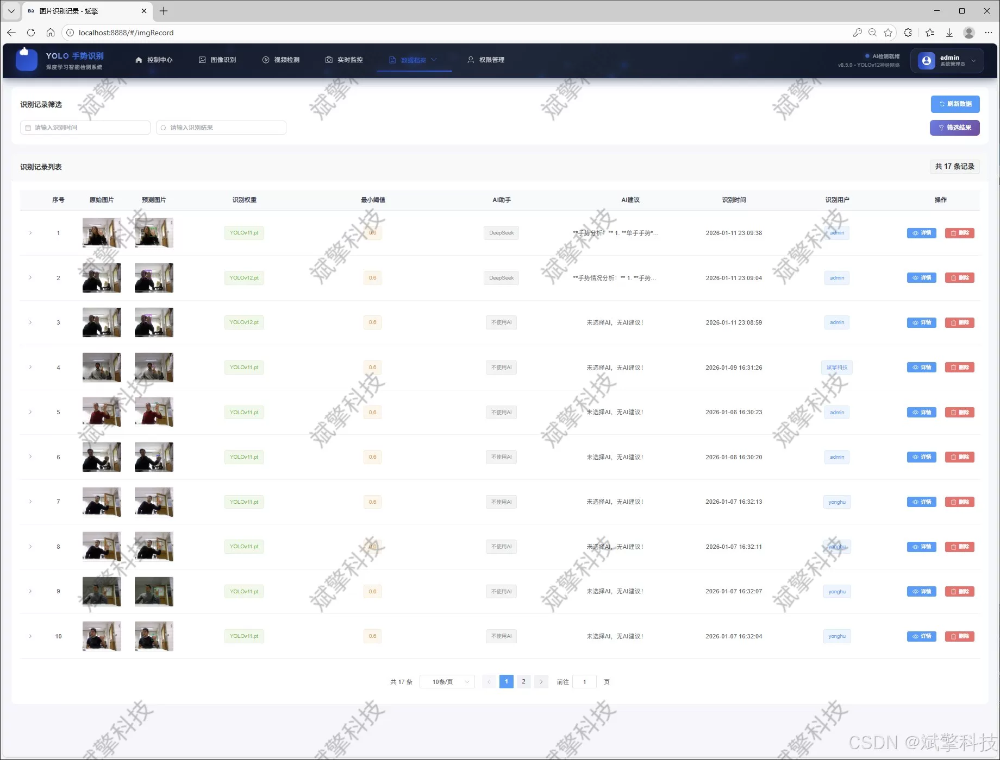
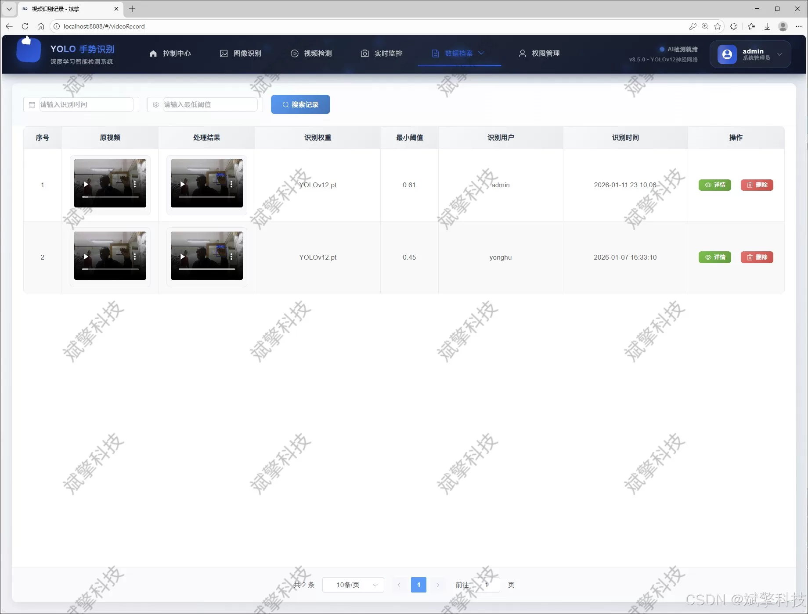
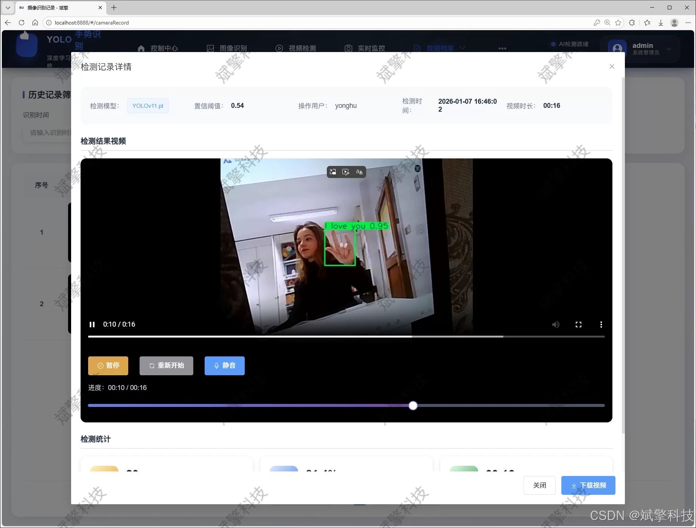
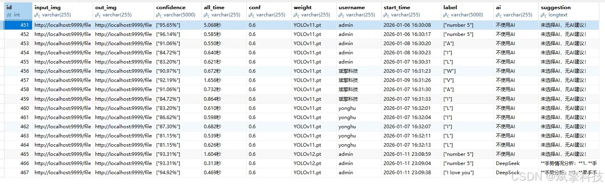
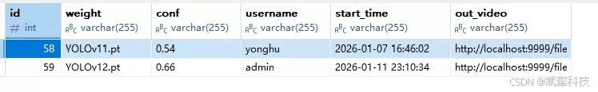

# Gesture Recognition Detection System

## Body

The gesture recognition detection system is based on YOLO deep learning and the large models of Qianwen and DeepSeek. The system (DeepSeek intelligent analysis + web interaction interface + front-end separation + YOLO data + YOLOv8/YOLOv10/YOLOv11/YOLOv12)

With the rapid development of artificial intelligence and computer vision technology, gesture recognition based on visual technology has become a key research topic in natural human-computer interaction, intelligent monitoring, virtual reality and other fields. Traditional gesture recognition methods often face challenges such as complex feature extraction, poor environmental adaptability, and insufficient real-time performance. The purpose of this project is to design and implement a high-performance, high-availability, and intelligent analysis capability real-time gesture recognition and detection system to address these challenges.

This system adopts a modern software architecture of "separation of front and back end" to construct a comprehensive Web application platform. The core of the backend is based on the efficient SpringBoot framework, combined with MySQL database for data persistence management, ensuring the stability and scalability of the system. The front end provides an intuitive and friendly web interaction interface, realizing rich functions such as user management, data visualization, multimodal detection task management, and result traceability. In terms of core recognition algorithms, the system creatively integrates four advanced YOLO series target detection models: YOLOv8, YOLOv10, YOLOv11, and YOLOv12, allowing users to dynamically switch and compare according to different precision and speed requirements, thus possessing high flexibility and foresight in technical selection. The system is trained and optimized for a custom dataset containing 10 specific gestures (‘A’, ‘number 7’, ‘D’, ‘I’, ‘L’, ‘V’, ‘W’, ‘Y’, ‘I love you’, ‘number 5’), totaling 1400 labeled images (1200 training set and 200 validation set). This dataset covers a variety of gesture postures and background environments.

The system not only provides accurate and real-time multi-class gesture recognition services, but also its modular design, multi-model support and deep intelligent analysis function integration provide a powerful comprehensive solution for the practical application and subsequent research of gesture recognition technology.

✅ User Login and Registration: Supports password detection, saves to MySQL database.

✅ Supports four YOLO model switches, YOLOv8, YOLOv10, YOLOv11, YOLOv12.

✅ Information Visualization, Data Visualization.

✅ Image detection supports AI analysis functions, deepseek and Qianwen.

✅ Supports image detection, video detection, and real-time camera detection. The results are saved to a MySQL database.

✅ Picture recognition record management, video recognition record management and camera recognition record management.

✅ User Management Module, administrators can add, delete, modify, and query users.

✅ Personal center, can modify their own information, password name profile picture and so on.

There is no Lunwen writing service, nor any Lunwen.

## Images

## Payment

Here is a pay link on Stripe ( https://buy.stripe.com/3cs8yP7sY87d0vu9AB ). Please contact me lonlonago@foxmail.com after funding $89, and I will send you a complete data files , thank you!

